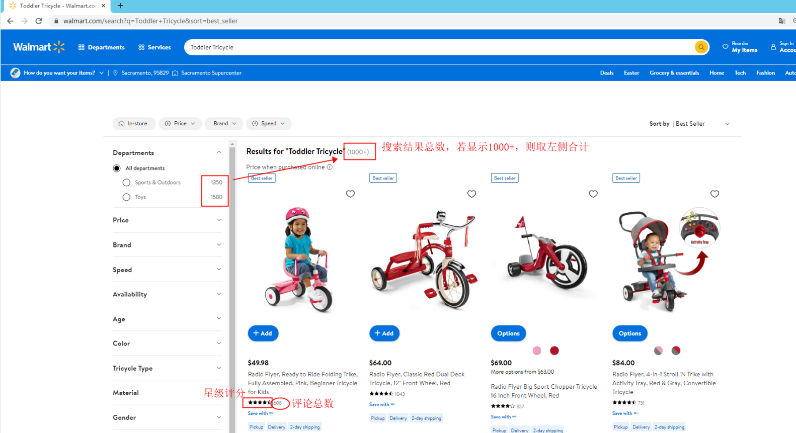

# 需求背景
## 1、详情页爬取
在walmart平台进行关键词搜索，或访问关键词搜索的链接，爬取所有搜索结果的产品详情页数据。
## 2、类目评论爬取
根据搜索结果链接，爬取搜索结果总数、首页结果的星级、评论数量等信息。
# 项目初始化及运行
1、启动redis服务。

2、运行`walmart_cookie_generate.py`，创建cookie池。cookie池数量视总爬取量而定。由于walmart反爬比较严格，建议每解析一个链接，消费一个cookie。

3、程序运行

① 详情页爬取：修改`walmart_keyword_crawl.py`中的`run(url_front, ky, cp)`，直接运行即可。

② 类目评论爬取：爬取目标链接，请修改`review_target.txt`，运行`walmart_review_crawl.py`。
# 爬取信息
## 1、详情页爬取
1、搜索结果数：获取方式见图1.8

2、是否做广告：获取方式见图1.8

3、品牌：获取方式见图1.9

4、类目路径：获取方式见图1.9

5、标题：获取方式见图1.9

6、价格：（如果是变体，价格都抓下来）获取方式见图1.9

7、是否带有Pro Seller标签：获取方式见图1.9

8、变体：（颜色/尺寸变体都抓下来）获取方式见图1.10

9、卖家形式：（分为Walmart和第三方卖家，即Sold by Walmart或者Sold by Seller）获取方式见图1.11-图1.13
    
10、发货方式：
    若卖家形式为Sold by Walmart填WFS；
    卖家形式为Sold by Seller时，需判断是否为Fulfilled By Walmart，若是，则填WFS，
    若否，则填FBM即可；获取方式见图1.11-图1.13

11、描述：获取方式见图1.14

12、评论数：获取方式见图1.15

13、星级：获取方式见图1.15

14、一星/二星/三星review（内容抓下来，如果有变体，变体也要抓下来）获取方式见图1.15

15、上架时间（就是抓取评论最早的日期），点击查看所有评论，选择“All Review”后选择“Oldest to Newest”，见图1.16
    
16、产品信息都抓下来：获取方式见图2.0

17、排名：排名就是在三级类目页，例如,排名P13 第一页第三个位置

  图1.8
  图1.9
  图1.10
  图1.11
  图1.12
  图1.13
  图1.14
  图1.15
  图1.16
  图2.0
## 2、类目评论爬取
